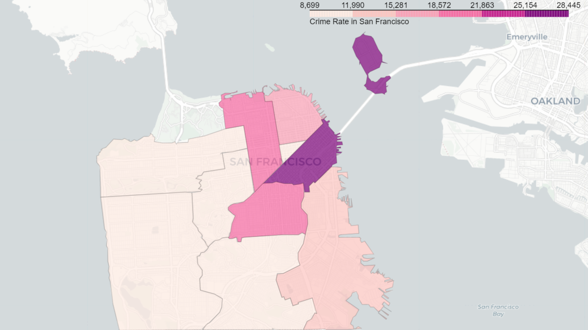

# Sanfrancisco-Crime-Survey
Comprehensive analysis and visualization of crimes of Sanfrancisco using Chloropleth map

## Dependencies

 
)

## Introduction

In the [Notebook here](SanFrancisco_Crime_Rate_Analysis.ipynb), we will visualize the crime rates in San Francisco using Choropleth map..

## Thanks for Reading :)
